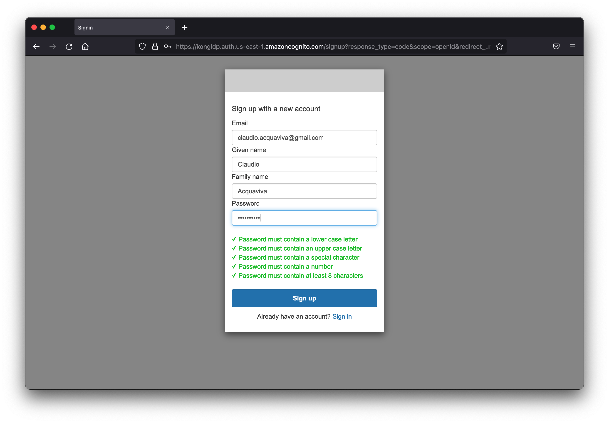
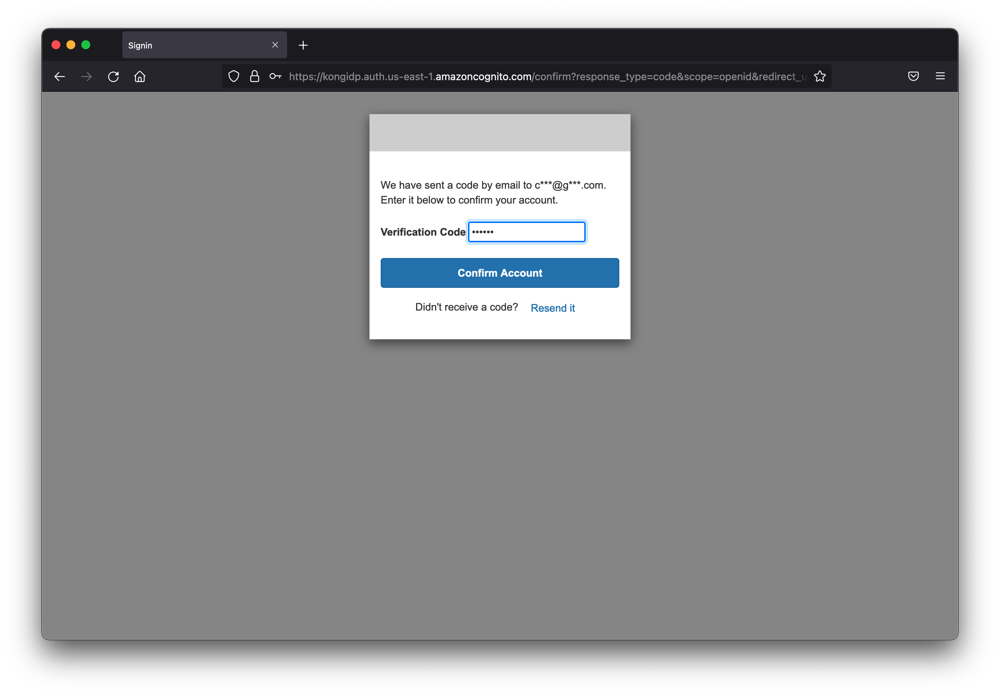

# Authentication-OpenID Connect

O plugin OpenID Connect (1.0) permite a integração com um provedor de identidade (IdP) de uma forma padronizada. Este plug-in pode ser usado para implementar Kong como um servidor de recursos (RS) OAuth 2.0 (proxy) e/ou como uma parte confiável (RP) do OpenID Connect entre o cliente e o serviço upstream.

O plug-in oferece suporte a vários tipos de credenciais e concessões:

Tokens de acesso JWT assinados (JWS) Tokens de acesso opacos Atualizar tokens Código de autorização Nome de usuário e senha Credenciais do cliente Cookies de sessão

Neste workshop, iremos configurar este plugin para usar o Amazon Cognito. Um guia de integração detalhado está disponível aqui para leitura futura. 

## Criação do AWS Cognito
Execute o seguinte comando para criar os AWS Cognito Resources usando um modelo CloudFormation
```bash
curl -O https://raw.githubusercontent.com/aws-samples/aws-modernization-with-kong/master/templates/cognito.yaml
aws cloudformation  deploy --template-file cognito.yaml --stack-name cognito-$C9_PID \
--parameter-overrides ClientName=$C9_PID-client Domain=$C9_PID PoolName=$C9_PID-pool CallBackUrl=https://$DATA_PLANE_LB/bar
echo "export COGNITO_CLIENT_ID=$(aws cloudformation describe-stack-resources --stack-name cognito-$C9_PID | jq -r '.StackResources[] | select(.ResourceType=="AWS::Cognito::UserPoolClient") | .PhysicalResourceId')" >> ~/.bashrc
bash
echo "export COGNITO_POOL_ID=$(aws cloudformation describe-stack-resources --stack-name cognito-$C9_PID | jq -r '.StackResources[] | select(.ResourceType=="AWS::Cognito::UserPool") | .PhysicalResourceId')" >> ~/.bashrc
bash
echo "ISSUER=https://cognito-idp.$AWS_REGION.amazonaws.com/$COGNITO_POOL_ID/.well-known/openid-configuration" >> ~/.bashrc
bash
```
:::note Nota
NOTE We are using $C9_PID environment variable in the above commands, so that each cognito pool created by users of this workshop is unique. If you are running this workshop at your own cadance without AWS Cloud9 environment, ensure to set this environment variable

Fetch the client secret
::: 
```bash
echo "export CLIENT_SECRET=$(aws cognito-idp describe-user-pool-client --user-pool-id $COGNITO_POOL_ID --client-id $COGNITO_CLIENT_ID --query 'UserPoolClient.ClientSecret')" >> ~/.bashrc
bash
```

## Instalando o plugin OIDC
```bash
cat <<EOF | kubectl apply -f -
apiVersion: configuration.konghq.com/v1
kind: KongPlugin
metadata:
  name: oidc
  namespace: default
config:
  client_id: [$COGNITO_CLIENT_ID]
  client_secret: [$CLIENT_SECRET]
  issuer: "$ISSUER"
  cache_ttl: 10
  redirect_uri: ["https://$DATA_PLANE_LB/bar"]
plugin: openid-connect
EOF
```
## Aplicar o plugin OIDC ao Ingress
```bash
kubectl patch ingress demo -p '{"metadata":{"annotations":{"konghq.com/plugins":"oidc"}}}'
```

## Verificação
Copie a saída de `echo https://$DATA_PLANE_LB/bar` e cole no navegador.
Depois de aceitar o certificado do servidor, uma vez que você não foi autenticado, você será redirecionado para a página de autenticação do Cognito:



Clique em “Sign up” para se cadastrar.



Após inserir seus dados clique em “Sign up”. O Cognito criará um usuário e solicitará o código de verificação enviado por seu e-mail.

Após digitar o código, o Cognito irá autenticá-lo, emitirá um Código de Autorização e o redirecionará de volta à URL original (Plano de Dados). O plano de dados se conecta ao Cognito com o código de autorização para obter o token de acesso e, em seguida, permite consumir a URL.

## Cleanup
Exclua o plugin do Kong executando o seguinte comando. A limpeza garante que este plugin não interfira com quaisquer outros módulos no workshop para fins de demonstração e cada código do módulo do workshop continua a funcionar independentemente.

```bash
kubectl delete kongplugin oidc
aws cloudformation delete-stack --stack-name cognito-$C9_PID
```

No cenário do mundo real, você pode habilitar quantos plugins desejar, dependendo de seus casos de uso.