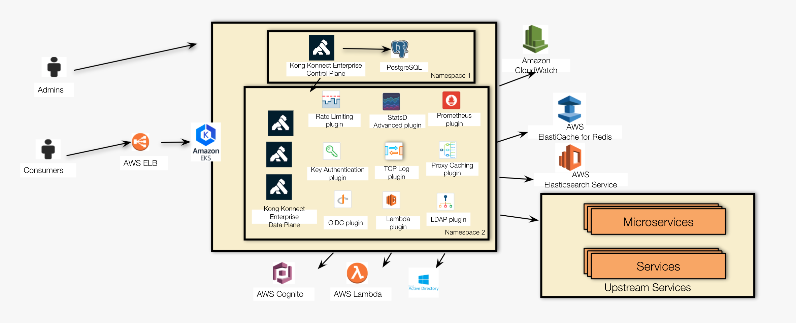

# Introducão

## Kong Enterprise Hybrid Mode 
Um dos recursos mais poderosos fornecidos pelo Kong Enterprise é o suporte para implantações híbridas. Em outras palavras, ele implementa clusters de gateway de API distribuídos em várias instâncias em vários ambientes ao mesmo tempo.

Além disso, Kong Konnect Enterprise oferece uma nova opção de topologia, denominada Hybrid Mode, com uma separação total do Plano de Controle (CP) e Plano de Dados (DP). Ou seja, enquanto o Plano de Controle é responsável pelas tarefas de administração, o Plano de Dados é utilizado exclusivamente por Consumidores de API.

Por favor, [aqui](https://docs.konghq.com/enterprise/2.6.x/deployment/hybrid-mode/) para ler mais sobre a implantação híbrida:

## Arquitetura de Referência
Aqui está uma Arquitetura de Referência que será implementada neste workshop:

 - O plano de controle e o plano de dados são executados em um cluster Elastic Kubernetes Service (EKS) em namespaces diferentes.
 - O banco de dados PostgreSQL está localizado atrás do CP.

Considerando os recursos fornecidos pela plataforma Kubernetes, a execução
de planos de dados nessa plataforma oferece um ambiente poderoso. Aqui estão
alguns recursos aproveitados pelo plano de dados no Kubernetes:

 - Alta disponibilidade: um dos principais recursos do Kubernetes é "autocura". Se um “pod” travar, o Kubernetes cuidará disso, reinicializando o “pod”.
 - Escalabilidade / elasticidade: HPA (“Horizontal Pod Autoscaler”) é a capacidade de inicializar e encerrar réplicas de “pod” com base em políticas previamente definidas. As políticas definem “limites” para informar ao Kubernetes as condições em que ele deve iniciar uma nova réplica de “pod” ou encerrar uma em execução.
 - Balanceamento de carga: a noção de serviço Kubernetes define um nível de abstração na parte superior das réplicas do “pod” que podem estar ativas ou desativadas (devido às políticas HPA, por exemplo). O Kubernetes mantém todas as réplicas de “pod” ocultas dos “chamadores” por meio dos Serviços. 

:::caution Cuidado
Este tutorial deve ser usado apenas para laboratórios e PoC. Existem muitos aspectos e processos, normalmente implementados em sites de produção, não descritos aqui. Por exemplo: emissão de certificado digital, monitoramento de cluster, etc. Para uma implantação pronta para produção, consulte Kong em AWS CDK Constructs, disponível
:::