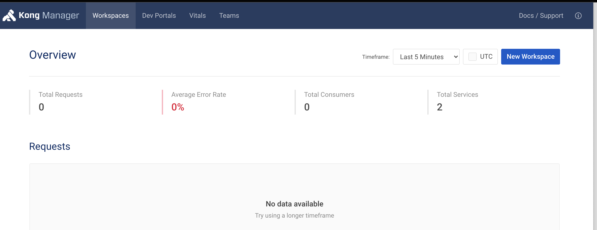

# Kong Control Plane

## Instale o Helm charts
Adicione o repositório do Kong

```bash
  helm repo add kong https://charts.konghq.com
  helm repo update
```

## Instale o Control Plane
Instale o helm chart usando o seguinte comando.

```bash
  helm install kong kong/kong -n kong \
  --set ingressController.enabled=true \
  --set ingressController.installCRDs=false \
  --set ingressController.image.repository=kong/kubernetes-ingress-controller \
  --set ingressController.image.tag=2.0.1 \
  --set image.repository=kong/kong-gateway \
  --set image.tag=2.6.0.0-alpine \
  --set env.database=postgres \
  --set env.role=control_plane \
  --set env.cluster_cert=/etc/secrets/kong-cluster-cert/tls.crt \
  --set env.cluster_cert_key=/etc/secrets/kong-cluster-cert/tls.key \
  --set cluster.enabled=true \
  --set cluster.tls.enabled=true \
  --set cluster.tls.servicePort=8005 \
  --set cluster.tls.containerPort=8005 \
  --set clustertelemetry.enabled=true \
  --set clustertelemetry.tls.enabled=true \
  --set clustertelemetry.tls.servicePort=8006 \
  --set clustertelemetry.tls.containerPort=8006 \
  --set proxy.enabled=true \
  --set admin.enabled=true \
  --set admin.http.enabled=true \
  --set admin.type=LoadBalancer \
  --set enterprise.enabled=true \
  --set enterprise.portal.enabled=false \
  --set enterprise.rbac.enabled=false \
  --set enterprise.smtp.enabled=false \
  --set enterprise.license_secret=kong-enterprise-license \
  --set manager.enabled=true \
  --set manager.type=LoadBalancer \
  --set secretVolumes[0]=kong-cluster-cert \
  --set postgresql.enabled=true \
  --set postgresql.postgresqlUsername=kong \
  --set postgresql.postgresqlDatabase=kong \
  --set postgresql.postgresqlPassword=kong
```
O Control Plane usa a porta 8005 para publicar qualquer nova configuração de API que possui.

## Validando a Instalação
```bash
  kubectl get all -n kong
```
**Resultado esperado: a conclusão da instalação do control-plane Kong pode levar de 2 a 3 minutos para ser concluído. Você deve ver um resultado semelhante ao seguinte, com pods no estado de execução**

```bash
  NAME                                  READY   STATUS      RESTARTS   AGE
  pod/kong-kong-57c8fc768-q6xwl         2/2     Running     0          2m18s
  pod/kong-kong-init-migrations-gbdqp   0/1     Completed   0          2m18s
  pod/kong-postgresql-0                 1/1     Running     0          2m18s

  NAME                                 TYPE           CLUSTER-IP       EXTERNAL-IP                                                               PORT(S)                         AGE
  service/kong-kong-admin              LoadBalancer   10.100.130.77    afa61d7bb9d6c4782807edde1a3deb57-1326257947.us-east-1.elb.amazonaws.com   8001:30197/TCP,8444:31551/TCP   2m19s
  service/kong-kong-cluster            ClusterIP      10.100.254.35    <none>                                                                    8005/TCP                        2m19s
  service/kong-kong-clustertelemetry   ClusterIP      10.100.221.36    <none>                                                                    8006/TCP                        2m19s
  service/kong-kong-manager            LoadBalancer   10.100.170.25    ac193ee6e63714d1993f9819d40fbf3b-1889322169.us-east-1.elb.amazonaws.com   8002:32302/TCP,8445:32311/TCP   2m19s
  service/kong-kong-portal             NodePort       10.100.135.200   <none>                                                                    8003:31791/TCP,8446:31049/TCP   2m19s
  service/kong-kong-portalapi          NodePort       10.100.148.172   <none>                                                                    8004:31430/TCP,8447:31704/TCP   2m19s
  service/kong-kong-proxy              LoadBalancer   10.100.243.231   a021901b01ac94cecaa12f9013ea9d0d-1495359368.us-east-1.elb.amazonaws.com   80:31273/TCP,443:31577/TCP      2m19s
  service/kong-postgresql              ClusterIP      10.100.49.159    <none>                                                                    5432/TCP                        2m19s
  service/kong-postgresql-headless     ClusterIP      None             <none>                                                                    5432/TCP                        2m19s

  NAME                        READY   UP-TO-DATE   AVAILABLE   AGE
  deployment.apps/kong-kong   1/1     1            1           2m19s

  NAME                                  DESIRED   CURRENT   READY   AGE
  replicaset.apps/kong-kong-57c8fc768   1         1         1       2m19s

  NAME                               READY   AGE
  statefulset.apps/kong-postgresql   1/1     2m19s

  NAME                                  COMPLETIONS   DURATION   AGE
  job.batch/kong-kong-init-migrations   1/1           42s        2m19s
```

## Verificando a porta da API do Kong Konnect Rest Admin
Use o balanceador de carga criado durante a implantação

```bash
  echo "export CONTROL_PLANE_LB=$(kubectl get service kong-kong-admin \-\-output=jsonpath='{.status.loadBalancer.ingress[0].hostname}' -n kong)" >> ~/.bashrc
  bash
```

:::note Nota
Não perca a execução do bash no final do comando acima, caso contrário, o valor de CONTROL_PLANE_LB não será carregado.
:::

```bash
  echo $CONTROL_PLANE_LB
```
```bash
  curl $CONTROL_PLANE_LB:8001 | jq .version
```

### Saída Esperada
```bash
  "2.6.0.0-enterprise-edition"
```

## Configurando o Kong Manager Service
Kong Manager é a GUI do Control Plane Admin. Ele deve obter o URI do administrador configurado com o mesmo endereço do balanceador de carga:

```bash
  kubectl patch deployment -n kong kong-kong -p "{\"spec\": { \"template\" : { \"spec\" : {\"containers\":[{\"name\":\"proxy\",\"env\": [{ \"name\" : \"KONG_ADMIN_API_URI\", \"value\": \"$CONTROL_PLANE_LB:8001\" }]}]}}}}"
```

## Logando no Kong Manager
Faça login no Kong Manager usando o balanceador de carga específico:

```bash
  echo "export KONG_MANAGER=$(kubectl get svc -n kong kong-kong-manager --output=jsonpath='{.status.loadBalancer.ingress[0].hostname}')" >> ~/.bashrc
  bash
```

```bash
  echo $KONG_MANAGER:8002
```
Copie a saída acima em um navegador local e você deverá ver a página inicial do Kong Manager.

:::note Nota
Algumas VPNs podem impedir que você visualize a página inicial. Se você receber uma tela branca no navegador, tente desconectar-se da VPN.
:::


