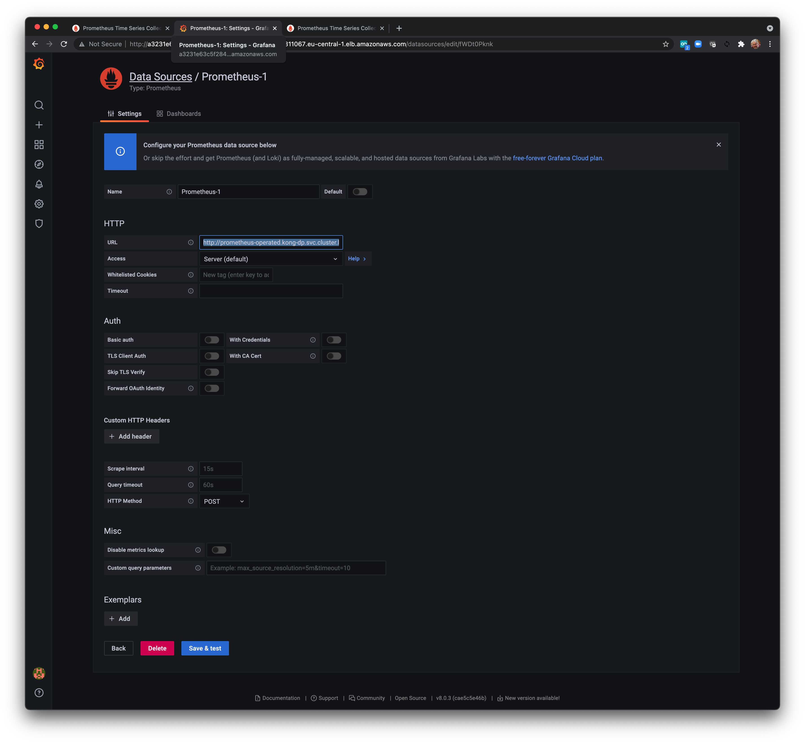
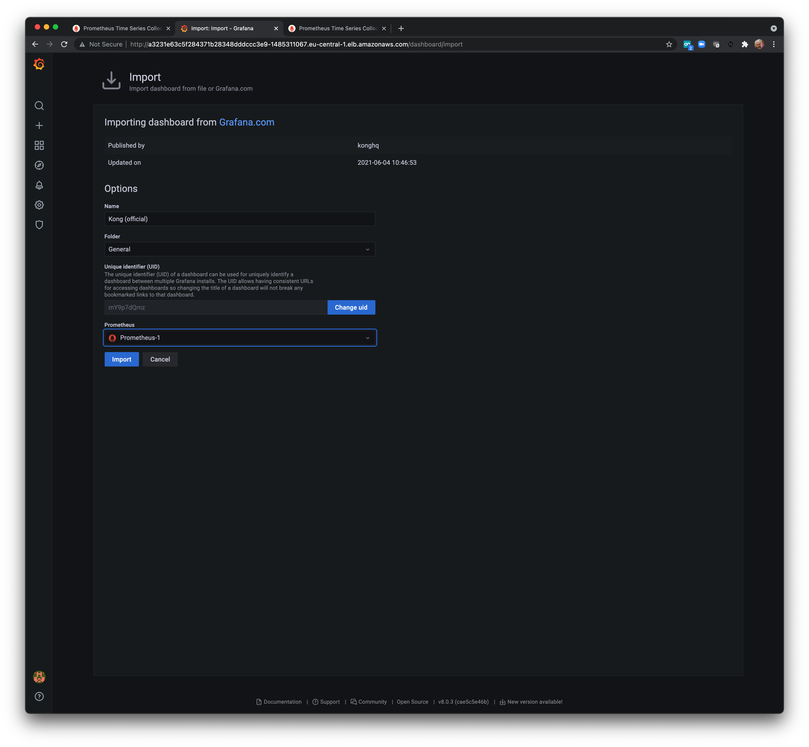

# Metricas do Data Plane
Para monitorar as réplicas dos planos de dados do Kong, vamos configurar um Monitor de serviço baseado em um serviço Kubernetes criado para os planos de dados.

## Crie um plugin Global Prometheus
Em primeiro lugar, temos de configurar o plugin específico do Prometheus fornecido pelo Kong. Após enviar a seguinte declaração, todos os Ingresses definidos terão o plugin habilitado e, portanto, incluirão suas métricas no endpoint do Prometheus exposto pelo Kong Data Plane.

Execute o seguinte comando

```bash
cat <<EOF | kubectl apply -f -
apiVersion: configuration.konghq.com/v1
kind: KongClusterPlugin
metadata:
  name: prometheus
  annotations:
    kubernetes.io/ingress.class: kong
  labels:
    global: "true"
plugin: prometheus
EOF
```

## Exponha o endpoint de métricas do data plane com um serviço Kubernete
A próxima coisa a fazer é expor a porta de métricas do data-plane como um novo serviço Kubernetes. O novo serviço Kubernetes será consumido pelo Prometheus Service Monitor que iremos configurar mais tarde.

O novo serviço Kubernetes será baseado na porta de métricas 8100 fornecida pelo data-plane. Definimos a porta durante a instalação do Data-Plane usando o parâmetro **--set env.status_listen = 0.0.0.0:8100**. Você pode verificar a porta em execução:

```bash
kubectl describe pod kong-dp-kong -n kong-dp | grep Ports
```

### Saída Esperada
```bash
  Ports:          8000/TCP, 8443/TCP, 8100/TCP
  Host Ports:     0/TCP, 0/TCP, 0/TCP
```

Para criar um novo serviço Kubernetes para expor as métricas do data plane, execute o seguinte

```bash
cat <<EOF | kubectl apply -f -
apiVersion: v1
kind: Service
metadata:
  name: kong-dp-monitoring
  namespace: kong-dp
  labels:
    app: kong-dp-monitoring
spec:
  selector:
    app.kubernetes.io/name: kong
  type: ClusterIP
  ports:
  - name: metrics
    protocol: TCP
    port: 8100
    targetPort: 8100
EOF
```

Observe que o novo serviço Kubernetes está selecionando o serviço Kubernetes de data-plane existente usando seu rótulo específico **app.kubernetes.io/name: kong**

Use pode verificar o rótulo em execução
```bash
kubectl get service -n kong-dp -o wide
```

### Saída Esperada

```bash
NAME                 TYPE           CLUSTER-IP     EXTERNAL-IP                                                                  PORT(S)                      AGE
kong-dp-kong-proxy   LoadBalancer   10.100.12.30   a6bf3f71a14a64dba850480616af8fc9-1188819016.eu-central-1.elb.amazonaws.com   80:32336/TCP,443:31316/TCP   54m
kong-dp-monitoring   ClusterIP      10.100.91.54   <none>                                                                       8100/TCP                     66s
```

## Teste o serviço.
Em um terminal local, exponha a porta 8100 usando port-forward
```bash
kubectl port-forward service/kong-dp-monitoring -n kong-dp 8100
```

### Saída Esperada
```bash
Forwarding from 127.0.0.1:8100 -> 8100
Forwarding from [::1]:8100 -> 8100
```

Agora abra outra guia do AWS Cloudshell (vá para **Actions**> **New Tab**)

```bash
curl localhost:8100/metrics
```

### Saida esperada
```bash
# HELP kong_datastore_reachable Datastore reachable from Kong, 0 is unreachable
# TYPE kong_datastore_reachable gauge
kong_datastore_reachable 1
# HELP kong_enterprise_license_errors Errors when collecting license info
# TYPE kong_enterprise_license_errors counter
kong_enterprise_license_errors 1
# HELP kong_memory_lua_shared_dict_bytes Allocated slabs in bytes in a shared_dict
# TYPE kong_memory_lua_shared_dict_bytes gauge
kong_memory_lua_shared_dict_bytes{shared_dict="kong"} 40960
………….
```

## Crie o Prometheus Service Monitor
Agora, vamos criar o Prometheus Service Monitor coletando métricas de todas as instâncias de planos de dados. O Service Monitor é baseado no novo serviço Kubernetes **kong-dp-monitoring** que criamos antes:
```bash
cat <<EOF | kubectl apply -f -
apiVersion: monitoring.coreos.com/v1
kind: ServiceMonitor
metadata:
  name: kong-dp-service-monitor
  namespace: kong-dp
  labels:
    release: kong-dp
spec:
  namespaceSelector:
    any: true
  endpoints:
  - port: metrics       
  selector:
    matchLabels:
      app: kong-dp-monitoring
EOF
```

## Iniciando uma instância do Prometheus para o Kong Data Plane
Uma instância específica do Prometheus será criada para monitorar o Kong Data Plane usando uma conta “kong-prometheus” específica. Antes de fazer isso, precisamos criar a conta e conceder permissões específicas.

```bash
cat <<EOF | kubectl apply -f -
apiVersion: v1
kind: ServiceAccount
metadata:
  name: kong-prometheus
  namespace: kong-dp
EOF
```

```bash
cat <<EOF | kubectl apply -f -
apiVersion: rbac.authorization.k8s.io/v1beta1
kind: ClusterRole
metadata:
  name: prometheus
rules:
- apiGroups: [""]
  resources:
  - nodes
  - nodes/metrics
  - services
  - endpoints
  - pods
  verbs: ["get", "list", "watch"]
- apiGroups: [""]
  resources:
  - configmaps
  verbs: ["get"]
- apiGroups:
  - networking.k8s.io
  resources:
  - ingresses
  verbs: ["get", "list", "watch"]
- nonResourceURLs: ["/metrics"]
  verbs: ["get"]
EOF
```

```bash
cat <<EOF | kubectl apply -f -
apiVersion: rbac.authorization.k8s.io/v1beta1
kind: ClusterRoleBinding
metadata:
  name: prometheus
roleRef:
  apiGroup: rbac.authorization.k8s.io
  kind: ClusterRole
  name: prometheus
subjects:
- kind: ServiceAccount
  name: kong-prometheus
  namespace: kong-dp
EOF
```
Instancie um serviço Prometheus para o data-plane Kong

```bash
cat <<EOF | kubectl apply -f -
apiVersion: monitoring.coreos.com/v1
kind: Prometheus
metadata:
  name: kong-dp-prometheus
  namespace: kong-dp
spec:
  serviceAccountName: kong-prometheus
  serviceMonitorSelector:
    matchLabels:
      release: kong-dp
  resources:
    requests:
      memory: 400Mi
  enableAdminAPI: true
EOF
```
Exponha o novo serviço Prometheus

```bash
kubectl expose service prometheus-operated --name prometheus-operated-lb -n kong-dp
```

```bash
kubectl get service -n kong-dp
```

### Saída Esperada
```bash
NAME                     TYPE           CLUSTER-IP      EXTERNAL-IP                                                               PORT(S)                      AGE
kong-dp-kong-proxy       LoadBalancer   10.100.11.50    a31effa06182047d7b6f24af2d938054-1892572230.us-east-2.elb.amazonaws.com   80:30251/TCP,443:32310/TCP   56m
kong-dp-monitoring       ClusterIP      10.100.22.163   <none>                                                                    8100/TCP                     5m36s
prometheus-operated      ClusterIP      None            <none>                                                                    9090/TCP                     4m1s
prometheus-operated-lb   ClusterIP      10.100.26.253   <none>                                                                    9090/TCP                     5s
```

## Adicionando Novo Serviço Prometheus ao Grafana
Crie uma nova fonte de dados Grafana com base no serviço Prometheus URL: http://prometheus-operated.kong-dp.svc.cluster.local:9090
Para fazer isso, copie a saída do comando a seguir e abra em um navegador.
```bash
echo $GRAFANA_LB/datasources/new
```
Selecione **Prometheus**, cole http://prometheus-operated.kong-dp.svc.cluster.local:9090 em HTTP > URL Section e clique em **Save & Test**



Agora, com base nesta nova fonte de dados, importe o painel oficial Kong Grafana com id **7424**

Para fazer isso, copie a saída do comando a seguir e abra em um navegador.

```bash
echo $GRAFANA_LB/dashboard/import
```

Digite **7424** em “Importar via grafana.com”> **Load**



Você deve ser capaz de ver as métricas do Kong Data Plane agora:

