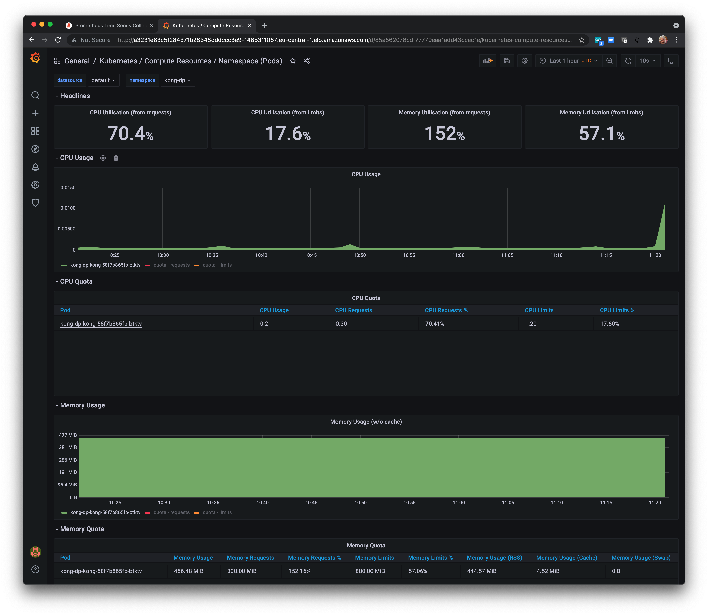
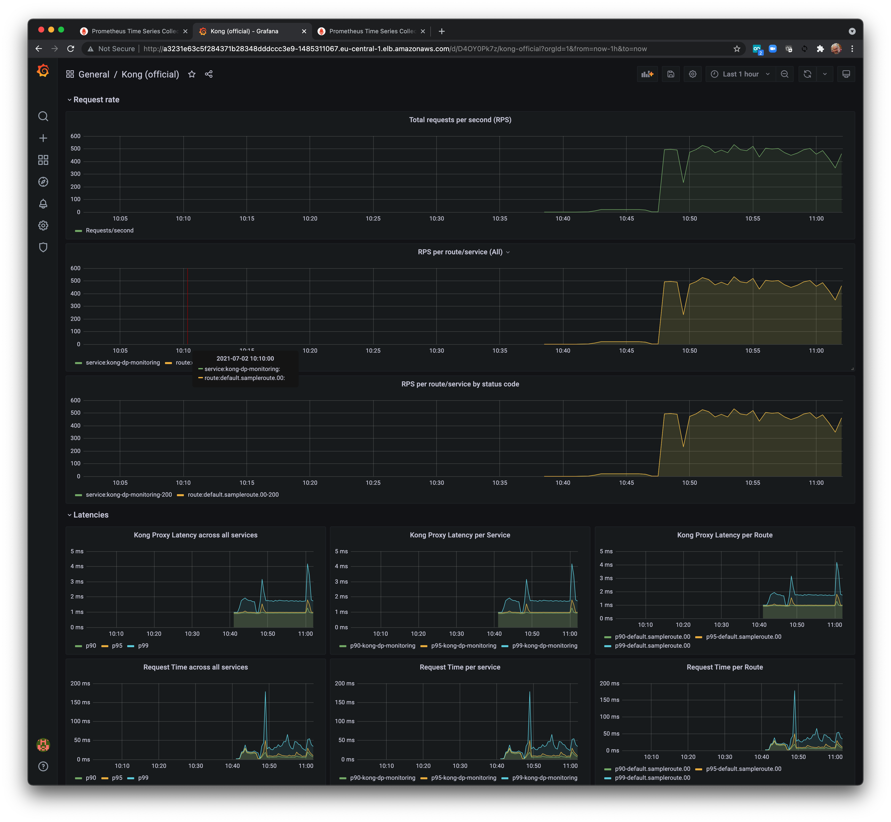
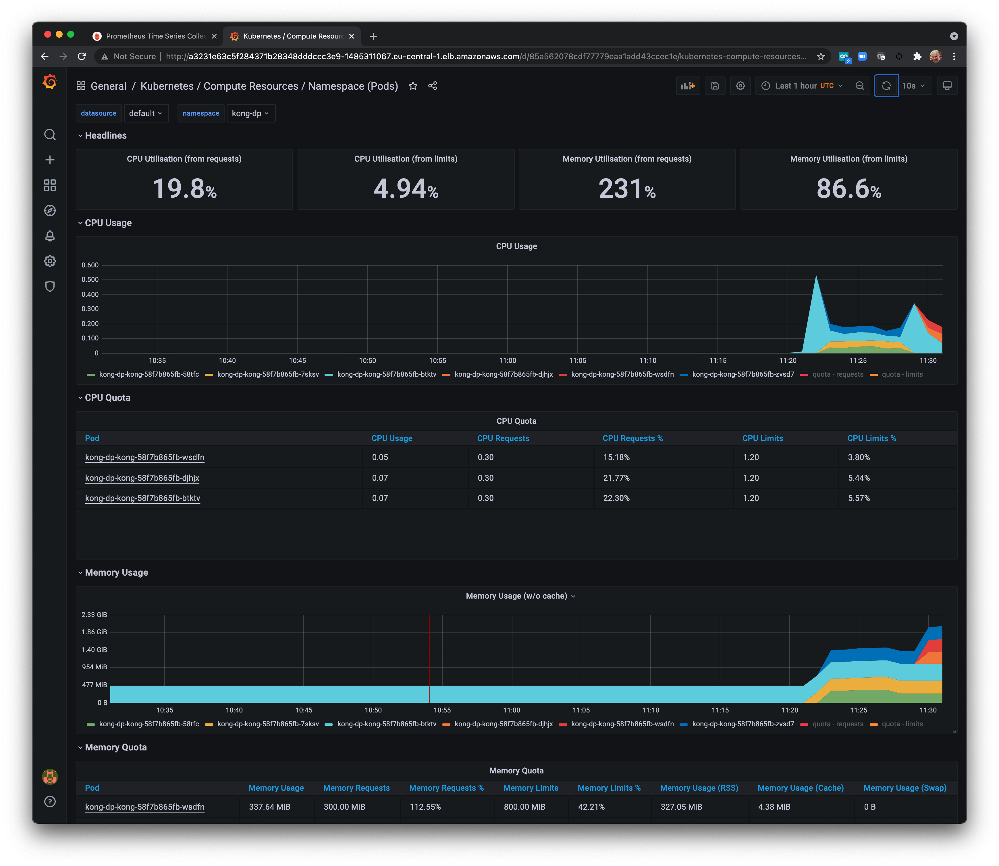

# Metricas

## Verifique Grafana
Direcione seu navegador para o Grafana novamente. Você pode obter o URL do Grafana executando echo $ GRAFANA_LB se necessário. Clique em Painéis e Gerenciar. Escolha o painel Kubernetes / Computer Resources / Namespaces (Pods). Escolha o namespace kong-dp.



Agora navegue até o painel Kong (oficial) para explorar os painéis de IU específicos de taxas de solicitação, latências, largura de banda, cache, upstream e Nginx



## Verifique HPA

Como estamos usando o HPA, o número de pods deve aumentar para atender às suas configurações.



Na verdade, podemos ver o novo status HPA atual com:
```bash
kubectl get hpa -n kong-dp
```
### Saída esperada

```bash
NAME           REFERENCE                 TARGETS   MINPODS   MAXPODS   REPLICAS   AGE
kong-dp-kong   Deployment/kong-dp-kong   15%/75%   1         20        3          15h
``` 