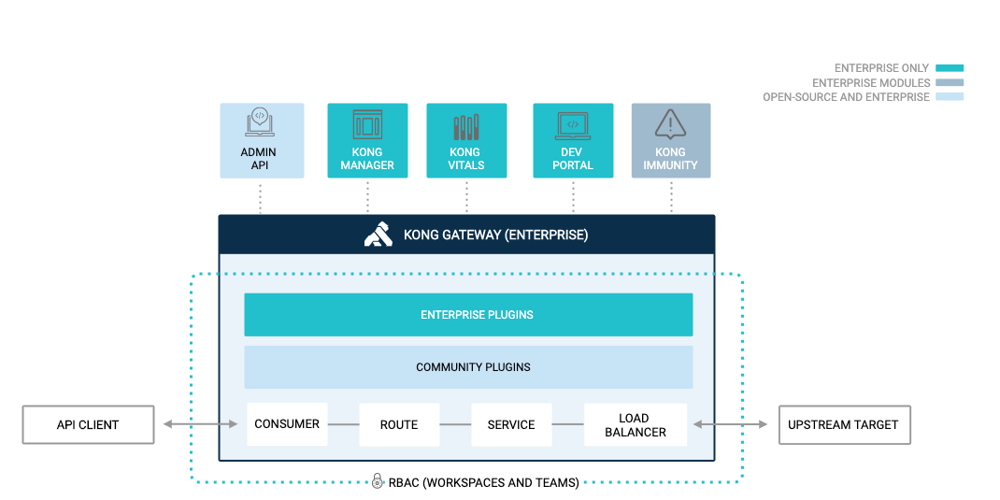

# O que é o Kong?

O Kong Gateway Enterprise é o Kong API Gateway com funcionalidades empresariais. Como parte do Kong Konnect, o gateway intermedia as informações de uma organização através de todos os serviços, permitindo que seus clientes tenham a gestão do ciclo de vida completo de serviços e APIs. Além disso, permite com que os usuários simplifiquem a gestão de APIs e microsserviços através de implantações hibridas e multi-cloud.

O Kong Gateway foi projetado para rodar em arquiteturas descentralizadas, aproveitando a automação do fluxo de trabalho e práticas de GitOps. Com o Kong Gateway, os usuários podem:

 - Descentralizar aplicações/serviços e transicionar para microsserviços
 - Criar um ecossistema próspero de desenvolvimento de APIs
 - Proativamente identificar anormalidades e ameaças relacionadas à APIs
 - Proteger e administrar APIs/serviços, e melhorar a visibilidade das APIs através da organização

O Kong Gateway Enterprise é a combinação de diversos recursos e módulos construidos em cima do Kong Gateway de código aberto, como mostrado no diagrama e descrito na próxima seção, Recursos do Kong Gateway Enterprise.
            

            
## Recursos do Kong Gateway Enterprise

As funcionalidades do Kong Gateway Enterprise estão descritas
nesta seção, incluindo módulos e plugins que ampliam e realçam a
funcionalidade da plataforma Kong Connect.
            
## Kong Gateway (OSS)
Kong Gateway (OSS) é um gateway cloud-native flexível, leve e
rápido. É fácil fazer o download, instalar e configurar uma vez
que você saiba o básico. O gateway roda na frente de qualquer API
RESTful e pode ser aprimorado através de módulos e plugins que
provém funcionalidades extras além do núcleo da plataforma.
## Kong Admin API
O Kong Admin API fornece uma interface RESTful para administração
e configuração de Serviços, Rotas, Plugins e Consumidores. Todas
as tarefas que você executa no Kong Manager podem ser
automatizadas usando o Kong Admin API.
## Kong Developer Portal
O Kong Developer Portal (Kong Dev Portal) é usado para integrar
novos desenvolvedores, gerar a documentação de APIs, criar páginas
customizadas, administrar versões de APIs e proteger o acesso de
desenvolvedores.
## Kong Immunity
O Kong Immunity usa machine learning para identificar, de forma
autônoma e em tempo real, anormalidades em serviços para mitigar
brechas e isolar problemas. Use o Kong Ummunity para, de forma
autônoma, identificar problemas em serviços usando a detecção de
anomalia com base em machine learning.
## Kubernetes Ingress Controller
Kong para Kubernetes Enterprise (K4K8S) é um Kubernetes Ingress
Controller. Um Kubernetes Ingress Controller é um proxy que expõe
serviços Kubernetes de aplicações (por exemplo, Deployments e
ReplicaSets) rodando em uma cluster Kubernetes para clientes de
aplicação rodando fora da cluster. A intenção do Ingress
Controller é de prover um único ponto de controle para todo
tráfego de entrada para a cluster Kubernetes.
## Kong Manager
O Kong Manager é uma Interface Gráfica de Usuário (GUI) para o
Kong Gateway Enterprise. Ela usa o Kong Admin API por baixo dos
panos para gerenciar e controlar o Kong Gateway (OSS). Use o Kong
Manager para organizar times, ajustar políticas, e monitorar a
performance com apenas alguns cliques. Junte seu time, serviços,
plugins, gestão de consumidores, e mais da forma que quiser com
ele. Crie novas rotas e serviços e ative e desative plugins em
segundos.
## Kong Plugins
Os plugins do Kong Gateway fornecem funcionalidades avançdas para
melhor gerir suas APIs e microsserviços. Com recursos chave para
encarar os casos de uso mais desafiantes, os plugins do Kong
Gateway Enterprise garantem controle máximo e minimiza sobrecarga
desnecessária. Haabilite recursos como autenticação,
rate-limiting, e transformações ativando plugins através do Kong
Manager ou do Kong Admin API.
## Kong Vitals
Kong Vitals fornece métricas úteis sobre a saúde e performance dos
seus nodes do Kong Gateway Enterprise, bem como métricas sobre o
uso das suas APIs que estão sendo publicadas pelo gateway. Você
pode monitorar visualmente sinais e localizar com precisão
anomalias em tempo real, e usar a API visual de analíticas para
ver como suas APIs e o Gateway estão performando, e acessar
estatísticas chave. Kong Vitals é parte da interface de usuário do
Kong Manager.
## Insomnia
O Insomnia possibilita o desenvolvimento "spec-first" para todos
os serviços REST e GraphQL. Com o Insomnia, as organizações
conseguem acelerar o projeto e testar fluxos de trabalho
utilizando testes automatizados, sincronização direta com o Git, e
inspeção de todos os tipos de respostas. Times de todos os
tamanhos podem usar o Insomnia para aumentar a agilidade no
desenvolvimento, reduzindo riscos de implantação, e aumentando
colaboração.
## Conceitos Chave e Terminologia
O Kong Gateway Enterprise usa termos comuns para entidades e
processos que tem um significado específico em contexto. Este
tópico fornece uma visão global conceitual sobre os termos, e como
eles se aplicam no caso de uso do Kong.
## Admin
Um Admin é uma conta de usuário do Kong Gateway capaz de acessar o
Admin API ou o Kong Manager. Com RBAC (controle de acesso baseado
na função) e workspaces, o acesso pode ser modificado e limitado
para entidades esṕecíficas.
## Autenticação
Autenticação é o processo no qual sistemas validam a identidade de
uma conta de usuário. É um conceito separado de autorização.

Autenticação por um API Gateway é uma forma importante de
controlar a informação que é permitida de ser transmitida para e
de suas APIs. Uma API pode ter uma lista de identidades restritas
que possuem acesso. Autenticação é o processo de prover uma
identidade.
## Autorização
Autorização é o systema de definir acesso para certos recursos. No
Kong Gateway, o controle de acesso baseado na função (RBAC) é a
principal forma de autorização. Para definir a autorização de uma
API, é possível utilizar o plugin de ACL em conjunto com algum
plugin de autenticação.
## Client
Um Client no Kong se refere a um cliente fazendo requisições para
o proxy do Kong. Ele pode ser outro serviço em uma aplicação
distribuída, a identidade de um usuário, o navegador de um
usuário, ou um aparelho específico.
## Consumer
Um objeto de Consumer (consumidor) representa o cliente de um
Serviço.

Um Consumer também é a entidade do Admin API representando um
desevolvedor ou uma máquina usando a API. Quando usado no Kong, um
Consumer só se comunica com o Kong, o qual transmite toda chamada
para o upstream desejado.

Você pode confiar no Kong como o banco de dados primário, ou pode
mapear uma lista de consumidores com seu banco de dados para
manter a consistência de seu banco de dados principal.
## Host
Um Host representa o domínio de hosts (usando DNS) destinado a
receber um tráfego upstream. No Kong, ele é a lista de nomes de
domínios que correspondem um objeto de Rota.
## Métodos
Métodos representam o método HTTP disponível para as requisições.
São aceitos vários valores, como por exemplo, GET, POST e DELETE.
O valor padrão é vazio (o método HTTP não é usado para
roteamento).
## Permissão
A permissão é a política representado a habilidade de criar, ler,
atualizar ou destruir uma entidade do Admin API definida por
endpoints.
## Plugin
Plugins eferecem funcionalidade avançada e extendem o uso do Kong
Gateway, permitindo que você adicione novas funcionalidades ao seu
gateway. Plugins podem ser configurados para rodar em vários
contextos, variando de uma rota específica até todos os upstreams.
Um plugin pode executar operações no seu ambiente, tais quais
autenticação, rate-limiting, ou transformações em uma requisição.
## Proxy
Kong é um proxy reverso que gerencia o tráfego entre clientes e
hosts. Como um gateway, a funcionalidade do proxy do Kong avalia
qualquer requisição HTTP recebida contra as rotas que você
configurou a procura de uma que combine. Se uma requisição
corresponde a regra de uma Rota específica, o Kong processa
encaminhando a requisição. Devido a cada Rota estar ligada a um
Serviço, o Kong roda os plugins ligados a sua Rota e seu Serviço
ao qual está associado, e enfim encaminha a requisição ao
upstream.
## Proxy Caching
Um dos benefícios chave de se usar um proxy reverso é a habilidade
de fazer cache de conteúdo frequentemente acessado. O benefício é
que o serviço de upstream não precisa gastar poder computacional
em requisições repetidas.

Uma das maneiras das quais o Kong entrega performance é através de
Proxy Caching, usando o plugin "Proxy Cache Advanced". Este plugin
suporta a eficiência da performance oferecendo a habilidade de
fazer cache de respostas baseadas em requisições, respostas e tipo
de conteúdo.

O Kong recebe a resposta de um serviço e guarda em um cache,
dentro de um período de tempo específico.

Para requisiçoes futuras dentro deste período de tempo, o Kong
responde utilizando o cache ao invés do serviço.

O período de duração do cache é configurável. Ao expirar, o Kong
envia novamente uma requisição para o serviço de upstream, guarda
o resultado, e então responde utilizando o cache até o período
expirar novamente.

O plugin guarda informações em memória. Como o plugin compete por
memória com outros processos, o uso do Redis é recomendado para
aumentar o desempenho.

## Rate Limiting
Rate limiting permite que você restrinja quantas requisições seu
serviço de upstream recebe de seus consumidores de API, ou com
qual frequência cada usuário pode chamar a API. Rate limiting
proteje as APIs de uso excessivo negligente ou malicioso. Sem rate
limiting, cada usuário pode fazer quantas chamadas deseja, o que
pode causar picos de acesso e prejudicar outros consumidores. Após
ativar o rate limiting, as chamadas de API são limitadas para um
número fixo de requisições por segundo.

Neste workshop, vamos habilitar o plugin de Rate Limiting
avançado. Este plugin oferece suporte ao algoritmo de janela
deslizante, o qual previne que a API seja sobrecarregada próximo a
limites de janelas, e adiciona suporte ao Redis para melhor
performance.

## Role (Função)
            
Um Role (Função) é um conjunto de permissões que podem ser
reusadas e atribuídas para Admins.

## Route (Rota)
            
Uma Rota, também referida como objeto de rota, define regras de
como bater requisições de clientes com serviços de upstreams. Cada
Rota é associada com um Serviço, e um serviço pode ter múltiplas
Rotas associadas a ele. Rotas são pontos de entrada no Kong, e
definem regras para corresponder a requisições de clientes. Quando
acontece a correspondência de uma Rota, o Kong encaminha a
requisição para o Serviço associado.

## Service (Serviço)
            
Um Serviço, tembém referido como objeto de Serviço, é o upstream
de APIs e microsserviços que o Kong gerencia. Exemplos de Serviços
são microsserviços de transformação de informação, uma API de
cobrança, e assim por diante. O atributo principal de um Serviço é
a URL (a qual o Kong deve encaminhar o tráfego), que pode ser
setada com uma única string ou espeficificando o protocolo, host,
porta e path individualmente.

Antes que você possa começar a fazer requisições a um Serviço,
você precisa associar uma Rota a ele. Rotas espefificam como (e
se) requisições são enviadas para seus serviços depois de chegarem
ao Kong. Um único serviço pode ter diversas Rotas. Após configurar
o Serviço e Rota, você será capaz de fazer requisições através do
Kong as utilizando.

## Super Admin
            
Um Super Admin, ou qualquer Role (Função) com acesso de ler e
escrever nos endpoints de /admin e /rbac, criam novos Roles e
customizam persissões. Um Super Admin pode:

 - Convidar e desabilitar outras contas de Admin
 - Atribuir e revogar Roles para Admins
 - Criar novos Roles com permissões costomizadas
 - Criar novas Workspaces

## Tags
            
Tags são etiquetas definidas pelo cliente que permite com que você
conduza, procure, e filtre entidades usando o parâmetro ?tag na
querystring. Cada tag deve ser composta de um ou mais characteres
alphanumericos, _, -, . ou ~. A maioria das entidades principais
podem ser taggeadas através do atributo de tags, seja no momento
de criação ou edição.

## Teams (Times)
            
Times organizam desenvolvedores em grupos de trabalho,
implementando políticas através de ambientes inteiros, e integram
novos usuários enquanto garantem conformidade. O Controle de
acesso baseado em função (RBAC) e Workspaces permitem que usuários
atribuam privilégios administrativos e concedam ou limitam acessos
privilegiados para usuários individuais e consumidores, times
inteiros, e ambientes através da plataforma Kong.

## Upstream
            
Um objeto de Upstream se refere a seu serviço/API sentado atrás do
Kong, para o qual o requisições de clientes são encaminhadas. Um
objeto de Upstream representa um hostname virtual e pode ser usado
para fazer o balanceamento de carga de requisições recebidas
através de múltiplos serviços (alvos). Por Exemplo, um Upstream
nomeado service.v1.xyz para um objeto de Serviço ao qual o host é
service.v1.xyz. Requisições para este objeto de serviço seriam
encaminhadas para o alvo definido ndentro do upstream.

## Workspaces
            
Workspaces permitem que uma organização segmente objetos e
administradores em namespaces. A segmentação permite que times de
administradores compartilhando a mesma cluster de Kong a adotarem
funções (roles) para interagir com objetos específicos. Por
exemplo, um time (Time A) talvez seja responsável por gerir um
certo serviço, enquanto outro time (Time B) seja responsável por
gerir outro serviço específico.

Várias organizações tem requerimentos de segurança rigorosos. Por
exemplo, organizações precisam da habilidade de segregar as
obrigações de um administrador para garantir que um equívoco ou
ato malicioso de um administrador não cause uma interrupção total.